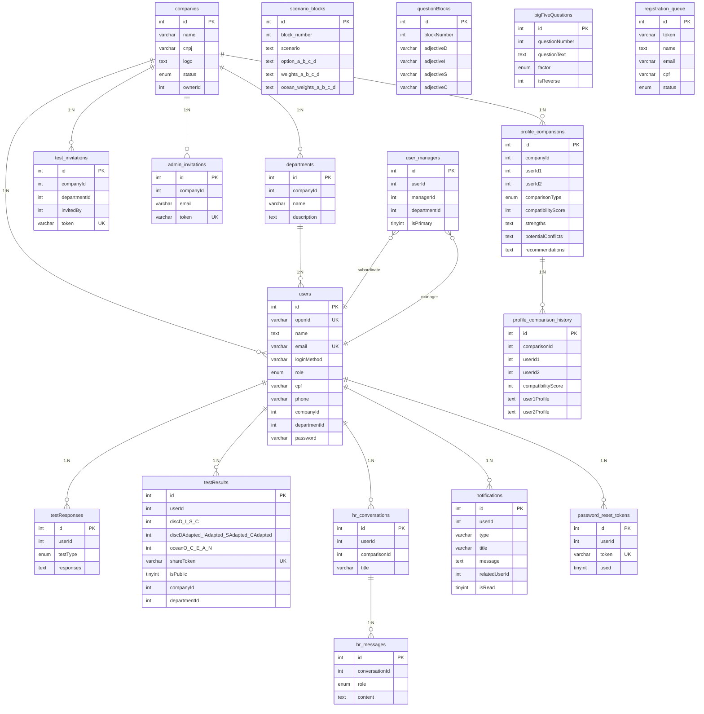

# Talent-IA - Schema do Banco Legado (MySQL)

Sistema legado hospedado em TiDB Cloud (MySQL compativel).
18 tabelas, 502 usuarios, 308 resultados de testes.

---

## Diagrama de Relacionamentos

---

## Tabelas

### 1. `users` (502 registros)

Tabela principal de usuarios. No sistema legado, concentra autenticacao, perfil e roles em uma unica tabela.

| Coluna | Tipo | Null | Key | Default |
|--------|------|------|-----|---------|
| `id` | int(11) | NOT NULL | PK | auto_increment |
| `openId` | varchar(64) | NULL | UNI | NULL |
| `name` | text | NULL | - | NULL |
| `email` | varchar(320) | NULL | UNI | NULL |
| `loginMethod` | varchar(64) | NULL | - | NULL |
| `createdAt` | timestamp | NOT NULL | - | CURRENT_TIMESTAMP |
| `updatedAt` | timestamp | NOT NULL | - | CURRENT_TIMESTAMP on update |
| `lastSignedIn` | timestamp | NOT NULL | - | CURRENT_TIMESTAMP |
| `role` | enum('master_admin','company_admin','leader','user') | NOT NULL | - | 'user' |
| `cpf` | varchar(14) | NULL | - | NULL |
| `phone` | varchar(20) | NULL | - | NULL |
| `companyId` | int(11) | NULL | - | NULL |
| `departmentId` | int(11) | NULL | - | NULL |
| `password` | varchar(255) | NULL | - | NULL |

**Distribuicao de roles:** master_admin: 4, company_admin: 12, leader: 1, user: 485
**Metodos de login:** google: 34, email: 320, invite: 108, manual: 38, null: 2

---

### 2. `companies` (29 registros)

| Coluna | Tipo | Null | Key | Default |
|--------|------|------|-----|---------|
| `id` | int(11) | NOT NULL | PK | auto_increment |
| `name` | varchar(255) | NOT NULL | - | - |
| `cnpj` | varchar(18) | NULL | - | NULL |
| `logo` | text | NULL | - | NULL |
| `status` | enum('active','inactive') | NOT NULL | - | 'active' |
| `ownerId` | int(11) | NOT NULL | - | - |
| `createdAt` | timestamp | NOT NULL | - | CURRENT_TIMESTAMP |
| `updatedAt` | timestamp | NOT NULL | - | CURRENT_TIMESTAMP on update |

---

### 3. `departments` (26 registros)

| Coluna | Tipo | Null | Key | Default |
|--------|------|------|-----|---------|
| `id` | int(11) | NOT NULL | PK | auto_increment |
| `companyId` | int(11) | NOT NULL | - | - |
| `name` | varchar(255) | NOT NULL | - | - |
| `description` | text | NULL | - | NULL |
| `createdAt` | timestamp | NOT NULL | - | CURRENT_TIMESTAMP |

---

### 4. `scenario_blocks` (15 registros)

Cenarios do teste com 4 opcoes e pesos DISC + OCEAN. Pesos armazenados como TEXT (JSON stringificado).

| Coluna | Tipo | Null | Key | Default |
|--------|------|------|-----|---------|
| `id` | int(11) | NOT NULL | PK | auto_increment |
| `block_number` | int(11) | NOT NULL | - | - |
| `scenario` | text | NOT NULL | - | - |
| `option_a` | text | NOT NULL | - | - |
| `option_b` | text | NOT NULL | - | - |
| `option_c` | text | NOT NULL | - | - |
| `option_d` | text | NOT NULL | - | - |
| `weights_a` | text | NOT NULL | - | - |
| `weights_b` | text | NOT NULL | - | - |
| `weights_c` | text | NOT NULL | - | - |
| `weights_d` | text | NOT NULL | - | - |
| `ocean_weights_a` | text | NOT NULL | - | - |
| `ocean_weights_b` | text | NOT NULL | - | - |
| `ocean_weights_c` | text | NOT NULL | - | - |
| `ocean_weights_d` | text | NOT NULL | - | - |

**Exemplo de peso:** `{"D":1,"I":0,"S":-0.5,"C":-0.5}`

---

### 5. `questionBlocks` (12 registros)

Blocos de adjetivos DISC (teste classico por adjetivos). Sem equivalente no novo sistema.

| Coluna | Tipo | Null | Key | Default |
|--------|------|------|-----|---------|
| `id` | int(11) | NOT NULL | PK | auto_increment |
| `blockNumber` | int(11) | NOT NULL | - | - |
| `adjectiveD` | varchar(100) | NOT NULL | - | - |
| `adjectiveI` | varchar(100) | NOT NULL | - | - |
| `adjectiveS` | varchar(100) | NOT NULL | - | - |
| `adjectiveC` | varchar(100) | NOT NULL | - | - |

**Exemplo:** blockNumber: 1, D: "Determinado", I: "Entusiasta", S: "Paciente", C: "Preciso"

---

### 6. `bigFiveQuestions` (22 registros)

Perguntas do teste Big Five (OCEAN). Sem equivalente no novo sistema.

| Coluna | Tipo | Null | Key | Default |
|--------|------|------|-----|---------|
| `id` | int(11) | NOT NULL | PK | auto_increment |
| `questionNumber` | int(11) | NOT NULL | - | - |
| `questionText` | text | NOT NULL | - | - |
| `factor` | enum('O','C','E','A','N') | NOT NULL | - | - |
| `isReverse` | int(11) | NOT NULL | - | 0 |

**Exemplo:** "Tenho uma imaginacao vivida e criativa." (fator: O, reverse: false)

---

### 7. `testResponses` (12 registros)

Respostas brutas dos testes. Armazena um JSON blob por tipo de teste.

| Coluna | Tipo | Null | Key | Default |
|--------|------|------|-----|---------|
| `id` | int(11) | NOT NULL | PK | auto_increment |
| `userId` | int(11) | NOT NULL | - | - |
| `testType` | enum('disc_natural','disc_adapted','big_five') | NOT NULL | - | - |
| `responses` | text | NOT NULL | - | - |
| `createdAt` | timestamp | NOT NULL | - | CURRENT_TIMESTAMP |

**Formato DISC:** `[{"blockNumber":1,"most":"D","least":"S"}, ...]`
**Formato Big Five:** `[{"questionNumber":1,"score":5}, ...]`

---

### 8. `testResults` (308 registros)

Resultados calculados. Scores DISC e OCEAN em colunas individuais (flat).

| Coluna | Tipo | Null | Key | Default |
|--------|------|------|-----|---------|
| `id` | int(11) | NOT NULL | PK | auto_increment |
| `userId` | int(11) | NOT NULL | - | - |
| `discD` | int(11) | NOT NULL | - | - |
| `discI` | int(11) | NOT NULL | - | - |
| `discS` | int(11) | NOT NULL | - | - |
| `discC` | int(11) | NOT NULL | - | - |
| `discDAdapted` | int(11) | NOT NULL | - | - |
| `discIAdapted` | int(11) | NOT NULL | - | - |
| `discSAdapted` | int(11) | NOT NULL | - | - |
| `discCAdapted` | int(11) | NOT NULL | - | - |
| `oceanO` | int(11) | NOT NULL | - | - |
| `oceanC` | int(11) | NOT NULL | - | - |
| `oceanE` | int(11) | NOT NULL | - | - |
| `oceanA` | int(11) | NOT NULL | - | - |
| `oceanN` | int(11) | NOT NULL | - | - |
| `createdAt` | timestamp | NOT NULL | - | CURRENT_TIMESTAMP |
| `shareToken` | varchar(64) | NULL | UNI | NULL |
| `isPublic` | tinyint(1) | NOT NULL | - | 0 |
| `companyId` | int(11) | NULL | - | NULL |
| `departmentId` | int(11) | NULL | - | NULL |

**Exemplo:** discD: 15, discI: 0, discS: -12, discC: -3, oceanO: 44, oceanC: 43, ...

---

### 9. `profile_comparisons` (43 registros)

Comparacoes detalhadas entre perfis. Muitas colunas de texto para analise IA.

| Coluna | Tipo | Null | Key | Default |
|--------|------|------|-----|---------|
| `id` | int(11) | NOT NULL | PK | auto_increment |
| `companyId` | int(11) | NOT NULL | - | - |
| `userId1` | int(11) | NOT NULL | - | - |
| `userId2` | int(11) | NOT NULL | - | - |
| `comparisonType` | enum('leader_member','peer_to_peer') | NOT NULL | - | - |
| `compatibilityScore` | int(11) | NOT NULL | - | - |
| `strengths` | text | NOT NULL | - | - |
| `potentialConflicts` | text | NOT NULL | - | - |
| `recommendations` | text | NOT NULL | - | - |
| `createdAt` | timestamp | NOT NULL | - | CURRENT_TIMESTAMP |
| `updatedAt` | timestamp | NOT NULL | - | CURRENT_TIMESTAMP on update |
| `sharedWith` | text | NULL | - | NULL |
| `includeConflicts` | tinyint(1) | NOT NULL | - | 0 |
| `complementarities` | text | NULL | - | NULL |
| `workingTips` | text | NULL | - | NULL |
| `idealProjects` | text | NULL | - | NULL |
| `avoidanceList` | text | NULL | - | NULL |
| `leadershipStyle` | text | NULL | - | NULL |
| `delegationStrategies` | text | NULL | - | NULL |
| `communicationStrategies` | text | NULL | - | NULL |
| `keyMotivators` | text | NULL | - | NULL |
| `warningSignals` | text | NULL | - | NULL |
| `autonomyLevel` | text | NULL | - | NULL |
| `feedbackFrequency` | text | NULL | - | NULL |

---

### 10. `profile_comparison_history` (89 registros)

Historico de versoes das comparacoes. Sem equivalente no novo sistema.

| Coluna | Tipo | Null | Key | Default |
|--------|------|------|-----|---------|
| `id` | int(11) | NOT NULL | PK | auto_increment |
| `comparisonId` | int(11) | NOT NULL | - | - |
| `userId1` | int(11) | NOT NULL | - | - |
| `userId2` | int(11) | NOT NULL | - | - |
| `compatibilityScore` | int(11) | NOT NULL | - | - |
| `user1Profile` | text | NOT NULL | - | - |
| `user2Profile` | text | NOT NULL | - | - |
| `createdAt` | timestamp | NOT NULL | - | CURRENT_TIMESTAMP |

---

### 11. `test_invitations` (42 registros)

| Coluna | Tipo | Null | Key | Default |
|--------|------|------|-----|---------|
| `id` | int(11) | NOT NULL | PK | auto_increment |
| `companyId` | int(11) | NOT NULL | - | - |
| `departmentId` | int(11) | NULL | - | NULL |
| `invitedBy` | int(11) | NOT NULL | - | - |
| `token` | varchar(64) | NOT NULL | UNI | - |
| `expiresAt` | timestamp | NULL | - | NULL |
| `maxUses` | int(11) | NULL | - | NULL |
| `usedCount` | int(11) | NOT NULL | - | 0 |
| `isActive` | tinyint(1) | NOT NULL | - | 1 |
| `createdAt` | timestamp | NOT NULL | - | CURRENT_TIMESTAMP |

---

### 12. `admin_invitations` (14 registros)

Convites para admins de empresa. Sem equivalente no novo sistema.

| Coluna | Tipo | Null | Key | Default |
|--------|------|------|-----|---------|
| `id` | int(11) | NOT NULL | PK | auto_increment |
| `companyId` | int(11) | NOT NULL | - | - |
| `email` | varchar(320) | NOT NULL | - | - |
| `token` | varchar(64) | NOT NULL | UNI | - |
| `expiresAt` | timestamp | NOT NULL | - | - |
| `used` | tinyint(1) | NOT NULL | - | 0 |
| `createdBy` | int(11) | NOT NULL | - | - |
| `createdAt` | timestamp | NOT NULL | - | CURRENT_TIMESTAMP |

---

### 13. `user_managers` (20 registros)

| Coluna | Tipo | Null | Key | Default |
|--------|------|------|-----|---------|
| `id` | int(11) | NOT NULL | PK | auto_increment |
| `userId` | int(11) | NOT NULL | - | - |
| `managerId` | int(11) | NOT NULL | - | - |
| `departmentId` | int(11) | NOT NULL | - | - |
| `isPrimary` | tinyint(1) | NOT NULL | - | 0 |
| `createdAt` | timestamp | NOT NULL | - | CURRENT_TIMESTAMP |

---

### 14. `hr_conversations` (7 registros)

| Coluna | Tipo | Null | Key | Default |
|--------|------|------|-----|---------|
| `id` | int(11) | NOT NULL | PK | auto_increment |
| `userId` | int(11) | NOT NULL | - | - |
| `comparisonId` | int(11) | NULL | - | NULL |
| `title` | varchar(255) | NULL | - | NULL |
| `createdAt` | timestamp | NOT NULL | - | CURRENT_TIMESTAMP |
| `updatedAt` | timestamp | NOT NULL | - | CURRENT_TIMESTAMP on update |

---

### 15. `hr_messages` (18 registros)

| Coluna | Tipo | Null | Key | Default |
|--------|------|------|-----|---------|
| `id` | int(11) | NOT NULL | PK | auto_increment |
| `conversationId` | int(11) | NOT NULL | - | - |
| `role` | enum('user','assistant') | NOT NULL | - | - |
| `content` | text | NOT NULL | - | - |
| `createdAt` | timestamp | NOT NULL | - | CURRENT_TIMESTAMP |

---

### 16. `notifications` (7 registros)

| Coluna | Tipo | Null | Key | Default |
|--------|------|------|-----|---------|
| `id` | int(11) | NOT NULL | PK | auto_increment |
| `userId` | int(11) | NOT NULL | - | - |
| `type` | varchar(50) | NOT NULL | - | - |
| `title` | varchar(255) | NOT NULL | - | - |
| `message` | text | NOT NULL | - | - |
| `relatedUserId` | int(11) | NULL | - | NULL |
| `isRead` | tinyint(1) | NOT NULL | - | 0 |
| `createdAt` | timestamp | NOT NULL | - | CURRENT_TIMESTAMP |

---

### 17. `registration_queue` (0 registros)

Fila de registro de usuarios via convite. Sem equivalente no novo sistema.

| Coluna | Tipo | Null | Key | Default |
|--------|------|------|-----|---------|
| `id` | int(11) | NOT NULL | PK | auto_increment |
| `token` | varchar(64) | NOT NULL | - | - |
| `name` | text | NOT NULL | - | - |
| `email` | varchar(320) | NOT NULL | - | - |
| `cpf` | varchar(14) | NOT NULL | - | - |
| `phone` | varchar(20) | NOT NULL | - | - |
| `password` | varchar(255) | NULL | - | NULL |
| `status` | enum('pending','processing','completed','failed') | NOT NULL | - | 'pending' |
| `errorMessage` | text | NULL | - | NULL |
| `userId` | int(11) | NULL | - | NULL |
| `companyId` | int(11) | NULL | - | NULL |
| `attempts` | int(11) | NOT NULL | - | 0 |
| `createdAt` | timestamp | NOT NULL | - | CURRENT_TIMESTAMP |
| `processedAt` | timestamp | NULL | - | NULL |

---

### 18. `password_reset_tokens` (31 registros)

Tokens de reset de senha. Sem equivalente no novo sistema (Supabase Auth gerencia).

| Coluna | Tipo | Null | Key | Default |
|--------|------|------|-----|---------|
| `id` | int(11) | NOT NULL | PK | auto_increment |
| `userId` | int(11) | NOT NULL | - | - |
| `token` | varchar(64) | NOT NULL | UNI | - |
| `expiresAt` | timestamp | NOT NULL | - | - |
| `used` | tinyint(1) | NOT NULL | - | 0 |
| `createdAt` | timestamp | NOT NULL | - | CURRENT_TIMESTAMP |

---

## Mapeamento: Legado → Novo Sistema

### `users` → `auth.users` + `profiles` + `user_roles`

| Legado (`users`) | Novo (`auth.users`) | Novo (`profiles`) | Novo (`user_roles`) | Transformacao |
|-------------------|---------------------|--------------------|--------------------|---------------|
| `id` (INT) | `id` (UUID) | - | - | Gerar novo UUID, manter tabela de mapeamento INT→UUID |
| `email` | `email` | `email` | - | Copiar direto |
| `password` | `encrypted_password` | - | - | Re-hash com bcrypt para Supabase Auth |
| `name` | `raw_user_meta_data.name` | `name` | - | Copiar para metadata e profiles |
| `openId` | `raw_app_meta_data.openId` | - | - | Preservar para referencia |
| `loginMethod` | `raw_app_meta_data.provider` | - | - | Mapear: google→google, email/manual/invite→email |
| `role` | - | - | `role` | Copiar enum direto (valores identicos) |
| `cpf` | - | `cpf` | - | Copiar direto |
| `phone` | - | `phone` | - | Copiar direto |
| `companyId` (INT) | - | `company_id` (UUID) | `company_id` (UUID) | Mapear via tabela de IDs |
| `departmentId` (INT) | - | `department_id` (UUID) | - | Mapear via tabela de IDs |
| `createdAt` | `created_at` | `created_at` | - | Copiar direto |
| `updatedAt` | `updated_at` | - | - | Copiar direto |
| `lastSignedIn` | `last_sign_in_at` | - | - | Copiar direto |

### `companies` → `companies`

| Legado | Novo | Transformacao |
|--------|------|---------------|
| `id` (INT) | `id` (UUID) | Gerar UUID, manter mapeamento |
| `name` | `name` | Copiar direto |
| `cnpj` | `cnpj` | Copiar direto |
| `status` | `status` | Copiar direto (enum→text) |
| `logo` | - | **Descartado** (sem equivalente) |
| `ownerId` | - | **Descartado** (sem equivalente) |
| `createdAt` | `created_at` | Copiar direto |
| `updatedAt` | - | **Descartado** |

### `departments` → `departments`

| Legado | Novo | Transformacao |
|--------|------|---------------|
| `id` (INT) | `id` (UUID) | Gerar UUID, manter mapeamento |
| `companyId` (INT) | `company_id` (UUID) | Mapear via tabela de IDs |
| `name` | `name` | Copiar direto |
| `description` | - | **Descartado** (sem equivalente) |
| `createdAt` | `created_at` | Copiar direto |

### `testResults` → `test_results`

| Legado | Novo | Transformacao |
|--------|------|---------------|
| `id` (INT) | `id` (UUID) | Gerar UUID |
| `userId` (INT) | `user_id` (UUID) | Mapear via tabela de IDs |
| `discD`, `discI`, `discS`, `discC` | `disc_natural` (JSONB) | `{"D": discD, "I": discI, "S": discS, "C": discC}` |
| `discDAdapted`, `discIAdapted`, `discSAdapted`, `discCAdapted` | `disc_adapted` (JSONB) | `{"D": discDAdapted, "I": discIAdapted, ...}` |
| `oceanO`, `oceanC`, `oceanE`, `oceanA`, `oceanN` | `big_five` (JSONB) | `{"O": oceanO, "C": oceanC, "E": oceanE, "A": oceanA, "N": oceanN}` |
| - | `iem` | Calcular: `oceanO + oceanC + oceanE + oceanA - oceanN` (ou 0) |
| `shareToken` | `share_token` | Copiar direto |
| `isPublic` | - | **Descartado** (share_token ja serve esse proposito) |
| `createdAt` | `completed_at` | Copiar direto |
| `companyId` | - | **Descartado** (obtido via profiles) |
| `departmentId` | - | **Descartado** (obtido via profiles) |
| - | `ai_analysis` | Iniciar como `{}` (sera gerado pelo novo sistema) |

### `profile_comparisons` → `profile_comparisons`

| Legado | Novo | Transformacao |
|--------|------|---------------|
| `id` (INT) | `id` (UUID) | Gerar UUID |
| `userId1` (INT) | `user1_id` (UUID) | Mapear via tabela de IDs |
| `userId2` (INT) | `user2_id` (UUID) | Mapear via tabela de IDs |
| `comparisonType` | `comparison_type` | Copiar direto |
| `compatibilityScore` | `compatibility_score` | Copiar direto |
| `strengths` | `ai_analysis.strengths` | Mover para JSONB |
| `potentialConflicts` | `ai_analysis.potentialConflicts` | Mover para JSONB |
| `recommendations` | `ai_analysis.recommendations` | Mover para JSONB |
| `complementarities` | `ai_analysis.complementarities` | Mover para JSONB |
| `workingTips` | `ai_analysis.workingTips` | Mover para JSONB |
| `idealProjects` | `ai_analysis.idealProjects` | Mover para JSONB |
| `avoidanceList` | `ai_analysis.avoidanceList` | Mover para JSONB |
| `leadershipStyle` | `ai_analysis.leadershipStyle` | Mover para JSONB |
| `delegationStrategies` | `ai_analysis.delegationStrategies` | Mover para JSONB |
| `communicationStrategies` | `ai_analysis.communicationStrategies` | Mover para JSONB |
| `keyMotivators` | `ai_analysis.keyMotivators` | Mover para JSONB |
| `warningSignals` | `ai_analysis.warningSignals` | Mover para JSONB |
| `autonomyLevel` | `ai_analysis.autonomyLevel` | Mover para JSONB |
| `feedbackFrequency` | `ai_analysis.feedbackFrequency` | Mover para JSONB |
| `companyId` | - | **Descartado** (obtido via profiles) |
| `createdAt` | `created_at` | Copiar direto |

### `test_invitations` → `test_invitations`

| Legado | Novo | Transformacao |
|--------|------|---------------|
| `id` (INT) | `id` (UUID) | Gerar UUID |
| `companyId` (INT) | `company_id` (UUID) | Mapear via tabela de IDs |
| `departmentId` (INT) | `department_id` (UUID) | Mapear via tabela de IDs |
| `invitedBy` (INT) | `invited_by` (UUID) | Mapear via tabela de IDs |
| `token` | `token` | Copiar direto |
| `expiresAt` | `expires_at` | Copiar direto |
| `maxUses` | `max_uses` | Copiar direto |
| `usedCount` | `used_count` | Copiar direto |
| `isActive` | `is_active` | Copiar direto |
| `createdAt` | `created_at` | Copiar direto |

### `user_managers` → `user_managers`

| Legado | Novo | Transformacao |
|--------|------|---------------|
| `id` (INT) | `id` (UUID) | Gerar UUID |
| `userId` (INT) | `user_id` (UUID) | Mapear via tabela de IDs |
| `managerId` (INT) | `manager_id` (UUID) | Mapear via tabela de IDs |
| `isPrimary` | `is_primary` | Copiar direto |
| `departmentId` | - | **Descartado** (sem equivalente) |
| `createdAt` | `created_at` | Copiar direto |

### `hr_conversations` → `hr_conversations`

| Legado | Novo | Transformacao |
|--------|------|---------------|
| `id` (INT) | `id` (UUID) | Gerar UUID, manter mapeamento (para hr_messages) |
| `userId` (INT) | `user_id` (UUID) | Mapear via tabela de IDs |
| `title` | `title` | Copiar direto |
| `comparisonId` | - | **Descartado** (sem equivalente) |
| `createdAt` | `created_at` | Copiar direto |

### `hr_messages` → `hr_messages`

| Legado | Novo | Transformacao |
|--------|------|---------------|
| `id` (INT) | `id` (UUID) | Gerar UUID |
| `conversationId` (INT) | `conversation_id` (UUID) | Mapear via tabela de IDs (hr_conversations) |
| `role` | `role` | Copiar direto |
| `content` | `content` | Copiar direto |
| `createdAt` | `created_at` | Copiar direto |

### `notifications` → `notifications`

| Legado | Novo | Transformacao |
|--------|------|---------------|
| `id` (INT) | `id` (UUID) | Gerar UUID |
| `userId` (INT) | `user_id` (UUID) | Mapear via tabela de IDs |
| `type` | `type` | Copiar direto |
| `title` | `title` | Copiar direto |
| `message` | `message` | Copiar direto |
| `isRead` | `read` | Copiar direto |
| `relatedUserId` | - | **Descartado** (sem equivalente) |
| `createdAt` | `created_at` | Copiar direto |

---

## Tabelas sem equivalente no novo sistema

| Tabela legada | Registros | Decisao |
|---------------|-----------|---------|
| `questionBlocks` | 12 | **Descartar** - Novo sistema usa `scenario_blocks` com cenarios ao inves de adjetivos |
| `bigFiveQuestions` | 22 | **Descartar** - Perguntas Big Five integradas nos cenarios do novo sistema |
| `profile_comparison_history` | 89 | **Descartar** - Historico de versoes nao existe no novo sistema |
| `admin_invitations` | 14 | **Descartar** - Supabase Auth gerencia convites de admin |
| `registration_queue` | 0 | **Descartar** - Vazio, processo de registro diferente no novo sistema |
| `password_reset_tokens` | 31 | **Descartar** - Supabase Auth gerencia reset de senha |

---

## Colunas do legado sem equivalente no novo

| Tabela | Coluna | Motivo |
|--------|--------|--------|
| `companies` | `logo` | Nao implementado no novo sistema |
| `companies` | `ownerId` | Substituido por `user_roles` com `company_admin` |
| `departments` | `description` | Nao implementado no novo sistema |
| `users` | `openId` | Google OAuth ID - Supabase gerencia identidades |
| `users` | `loginMethod` | Supabase gerencia providers de auth |
| `users` | `updatedAt` | Nao rastreado em profiles |
| `users` | `lastSignedIn` | Rastreado pelo Supabase Auth |
| `testResults` | `isPublic` | Substituido por `share_token` |
| `testResults` | `companyId/departmentId` | Obtido via join com profiles |
| `hr_conversations` | `comparisonId` | Nao implementado no novo sistema |
| `notifications` | `relatedUserId` | Nao implementado no novo sistema |
| `user_managers` | `departmentId` | Nao implementado no novo sistema |

---

## Volume de dados

| Tabela | Registros | Prioridade de migracao |
|--------|-----------|----------------------|
| `companies` | 29 | 1 - Migrar primeiro (dependencia) |
| `departments` | 26 | 2 - Depende de companies |
| `users` | 502 | 3 - Depende de companies e departments |
| `testResults` | 308 | 4 - Depende de users |
| `profile_comparisons` | 43 | 5 - Depende de users |
| `test_invitations` | 42 | 6 - Depende de companies e users |
| `user_managers` | 20 | 7 - Depende de users |
| `hr_conversations` | 7 | 8 - Depende de users |
| `hr_messages` | 18 | 9 - Depende de hr_conversations |
| `notifications` | 7 | 10 - Depende de users |

**Total a migrar:** ~1.002 registros em 10 tabelas

---

## Estrategia de migracao (ordem de execucao)

1. **Criar tabela de mapeamento de IDs** (INT legado → UUID novo)
2. **Migrar `companies`** (29 registros)
3. **Migrar `departments`** (26 registros)
4. **Criar usuarios no Supabase Auth** (502 registros) — gerar `auth.users` com email + senha temporaria ou re-hash
5. **Migrar `profiles`** (502 registros) — usando UUIDs do auth.users
6. **Migrar `user_roles`** (502 registros) — um role por usuario
7. **Migrar `testResults` → `test_results`** (308 registros) — transformar flat→JSONB
8. **Migrar `profile_comparisons`** (43 registros) — consolidar colunas em `ai_analysis` JSONB
9. **Migrar `test_invitations`** (42 registros)
10. **Migrar `user_managers`** (20 registros)
11. **Migrar `hr_conversations`** (7 registros)
12. **Migrar `hr_messages`** (18 registros)
13. **Migrar `notifications`** (7 registros)
14. **Validar integridade** — conferir contagens e relacionamentos
